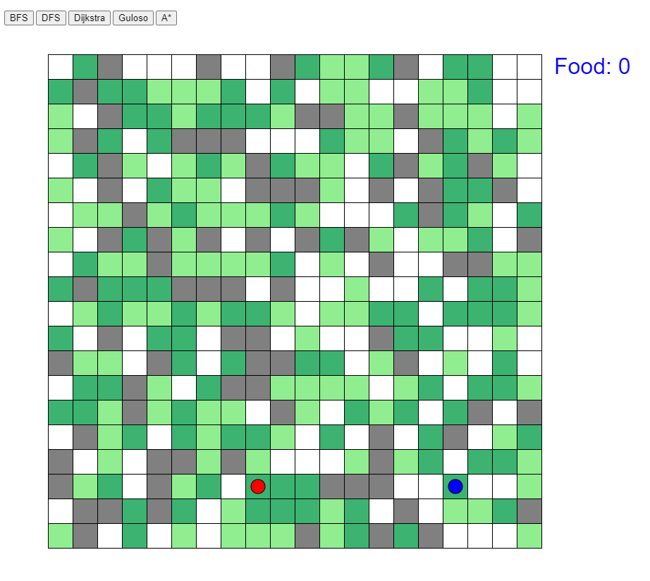

# Search Visualizer

This is a simple application that simulates an agent that continuously searches for food in the map and catches it, using the search algorithm chosen by the user.

# Development

This application was built using JavaScript, through the [p5.js](https://p5js.org) framework. We recommend using [Processing](https://processing.org/) to develop on it.

# How does it work?



The grid consists of different types of cells:
- Grey cells are walls, and the player CANNOT walk through these
- White cells are normal ground
- Green cells are slow ground
- Darker green cells are very slow ground

Walking in each of those cells is different algorithm-wise - for instance, walking in darker green cells will have a greater weight when building the graph connections between cells. Therefore, for a shortest path algorithm, walking in those cells will be avoided most times.

The player is the *red* dot, and the food is the *blue* dot.

# Running

- Open `index.html`
- Choose an algorithm by clicking its button

The agent will then search for the food and then follow the optimal path to it. Note that the path may not be the shortest - it is based on the algorithm choice.

# Algorithms

Below we will describe each algorithm used.

## BFS

Breadth-first search (BFS) is a way of traversing a graph layer by layer:
- First we visit all cells which are at distance 1 of the starting point
- Then we visit all cells which are at distance 2 of the starting point
- And so on. In the `n-th` step, we will visit cells which are at distance `n` of the starting point.

This algorithm runs until it finds the target.

## DFS

Depth-first search (DFS) is a way of traversing a graph where it will pick a branch, which is a sequence of cells that begins in the starting point, and each time we move to a cell, we are moving ONE unit away (does not consider ground weight) from our current position.

When a branch is fully visited, i.e. we have no more unvisited cells to go next, the algorithm goes back cell by cell in the traversed path, until there's a cell we can go to.

Example:

```
1 -- 2 -- 3 -- 4 -- 5 -- 6
          |         |
          |         7 -- 8
          9 -- 10
```

The algorithm will initially choose the path from 1 to 6 (1, 2, 3, 4, 5, 6).

Upon reaching 6, we have no other unvisited cells to go. The algorithm then backtracks to 5 - now we can explore the branch going to 7, and then 8.

Upon reaching 8, we have no other unvisited cells to go, again. The algorithm then backtracks to 4 (still no cells to go), and then when it reaches 3, it can go to 9 and follow its branch.

The algorithm stops when all cells are visited.

## Dijkstra

Dijkstra is a greedy algorithm that uses the concept of a priority queue to know which cell to visit next. This queue will prioritize cells which are at a lower distance from our starting point.

We have a starting point and a target cell. Initially, all cells are at a distance INFINITY from the starting cell. The starting cell will have distance 0, and will be put in the queue.

Then, the following steps are run:

```
- Until the queue is empty:
  - Pick the first cell (highest priority) from the queue and remove it from the queue
  - Lets call this cell S
  - If S was already visited, continue
  - If S is the target, *exit algorithm*
  - For each cell T adjacent to S:
    - let the current distance of T be dist_T
    - let the current distance of S be dist_S
    - let the type of the ground of T be ground_type_T
    - if dist_T > dist_S + ground_type_T
      - update the distance of T
      - enqueue T
```

## A*

A-star is very similar to Dijkstra. However, when updating the distance, in the following excerpt:

```
    - let the current distance of T be dist_T
    - let the current distance of S be dist_S
    - let the type of the ground of T be ground_type_T
    - if dist_T > dist_S + ground_type_T         <<<<<<<<<< here
      - update the distance of T
      - enqueue T
```

We also consider another value, which is an heuristic function. Therefore, the total distance of a cell T, when going from a cell S, is:

```
dist(T) = dist(S) + h(T) + ground_type_T
```

where h(T) is the heuristic function. Here, we consider this heuristic function to be the Euclidean distance from T to the target cell.

## Greedy

The greedy algorithm continuously goes to the cell with lowest ground type, assuming that it is always best to avoid walking in cells that are slow.
